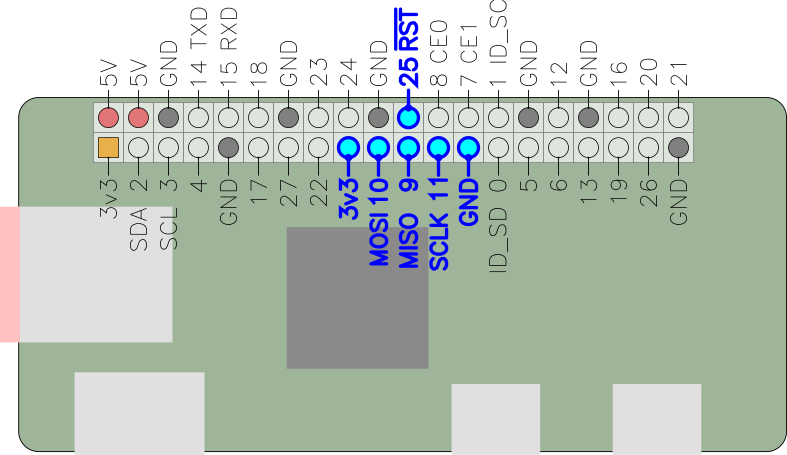

[gadget-doc](/README.md) / [avrisp](/avrisp/index.md)

AVR In-System Programming (AVRISP)
==================================

`avrdude` has a programmer driver which allows use of the linux `spidev`
interface for AVR ISP. Due to the way chip select works, it also needs to use
a single GPIO for the <span class="overline">RST</span> pin.
By default this is set to GPIO 25 (which has good locality with the SPI bus
pins) but this can be configured in `/etc/avrdude.conf`

To utilise it, use the programmer type `linuxspi` and the port `/dev/spi32766.0`.
For example, to read the device signature from an Atmega328p, use this command:

```
$ avrdude -c linuxspi -P /dev/spidev32766.0 -p atmega328p

```

Hardware connection
-------------------




ISP connector pinouts from [Sparkfun](https://learn.sparkfun.com/tutorials/tiny-avr-programmer-hookup-guide) CC BY-NC-SA 3.0:


## TODO

Need additional information about methods to get the hex file onto the Gadget
board.

Possibilities:

   * Samba share
   * `scp`
   * `ssh` and `stdin`?
   * USB Mass storage?
