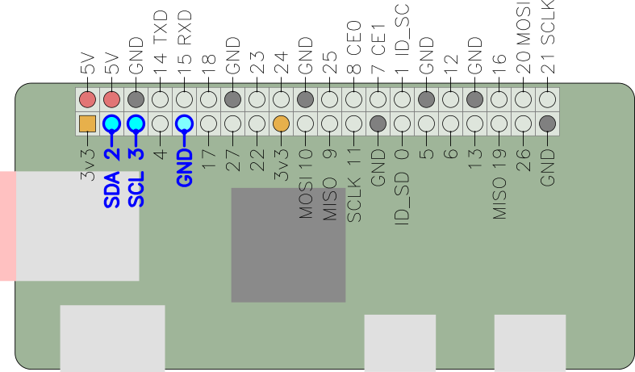
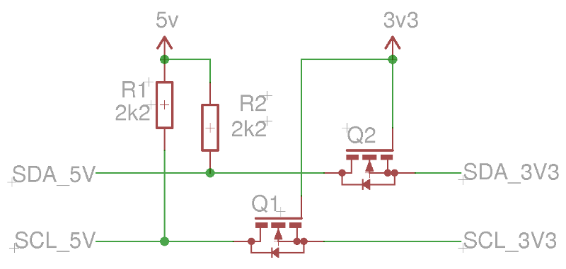

[gadget-doc](/README.md) / [i2c](/i2c/index.md)

i2c
===

[Inter-integrated circuit](https://en.wikipedia.org/wiki/I%C2%B2C), (`i2c` or
I²C) is a simple 3-wire serial bus widely used in all kinds of electronics.

Gadget has support for detecting and accessing i2c devices. i2c protocol
sniffing is not currently supported, but support is planned via
[sigrok](https://sigrok.org/) - see also [logic analyser](/logic/index.md).

The supported tools are:

 * [i2c-tools](#i2c-tools) - basic access of i2c devices
 * [Python SMBus](#python-smbus) - i2c bus access from Python

Interactive i2c bus access is provided by the `i2ci` command which is below
beta quality and so is ommitted from the documentation. It is included merely
on the basis that something is better than nothing.

Hardware connection
-------------------

<div class="warning">
<b>The Raspberry Pi i2c bus is 3v3 only.</b> There are on-board pull-up resistors to
3v3.

It is recommended to use an <a href="#level-shifting">i2c level shifter</a> for
connecting 5 V i2c devices to the Raspberry Pi
</div>

The Rapberry Pi's `i2c-1` bus is broken out on the GPIO header:



### i2c-tools

i2c-tools provides 3 commands for basic interaction with i2c devices:

   * `i2cdetect` - scans an i2c bus to find all slaves
   * `i2cset` - write to an i2c slave device
   * `i2cget` - read from an i2c slave device

#### `i2cdetect` Example invocation

Scan bus `/dev/i2c-1`. Output shown with one connected device at
slave address 0x40:
```
$ i2cdetect -y 1
     0  1  2  3  4  5  6  7  8  9  a  b  c  d  e  f
00:          -- -- -- -- -- -- -- -- -- -- -- -- --
10: -- -- -- -- -- -- -- -- -- -- -- -- -- -- -- --
20: -- -- -- -- -- -- -- -- -- -- -- -- -- -- -- --
30: -- -- -- -- -- -- -- -- -- -- -- -- -- -- -- --
40: 40 -- -- -- -- -- -- -- -- -- -- -- -- -- -- --
50: -- -- -- -- -- -- -- -- -- -- -- -- -- -- -- --
60: -- -- -- -- -- -- -- -- -- -- -- -- -- -- -- --
70: -- -- -- -- -- -- -- --
```

#### `i2cset`/`i2cget` Example invocation

Write 0x55 to register 5 of the slave at address 0x40 on bus 1, then
read back the same register:

```
$ i2cset -y 1 0x40 5 0x55
$ i2cget -y 1 0x40 5
0x55
```

### Python SMBus

The Pyton SMBus module provides access to the i2c bus. A basic read-then-write
example is given below:

```python
import smbus

# Open bus i2c-1
bus = smbus.SMBus(1)

# Write [55, 66, 77] to registers 5, 6 and 7 of the device at 0x40
bus.write_i2c_block_data(0x40, 5, [55, 66, 77])

# Read back 3 bytes starting at register 5
print bus.read_i2c_block_data(0x40, 5, 3)
```

## Level shifting

i2c is an open-collector bus. This means that the bus voltage is determined by
pull-up resistors. On the Raspberry Pi these are connected to 3v3, making the
i2c bus 3.3 volts.

Connecting to a 5 volt i2c device may work in this configuration, as long as
3.3 volts is high enough to be interpreted as "high" (true for most 5 V
devices), and as long as the device doesn't have pull-up resistors to 5 volts.

Using this kind of arrangement is somewhat dangerous however, as if the i2c
device were to drive 5 V onto the bus (due to malfunction, a bug, poor design,
whatever) you could damage the Pi's GPIO pins.

It is recommended to include an i2c level shifter circuit to interface 5 V i2c
devices with the Raspberry Pi. These can be easily purchased online, or you can
build one with a couple of N-channel MOSFETS and resistors using the following
circuit from an [NXP application note on i2c level
shifting](http://www.nxp.com/documents/application_note/AN10441.pdf):



\* The pull-up resistors on the 3v3 side are omitted from this schematic as
they are present on the Raspberry Pi board.
