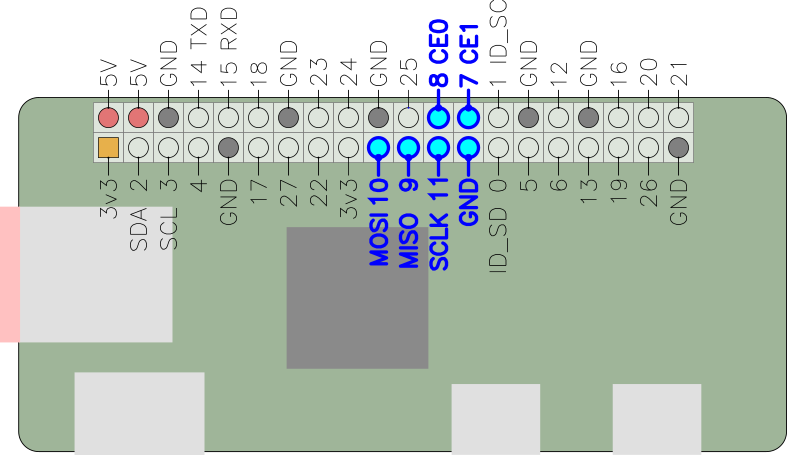

[gadget-doc](/README.md) / [spi](/spi/index.md)

Serial Peripheral Interface (SPI)
=================================

[SPI](https://en.wikipedia.org/wiki/Serial_Peripheral_Interface_Bus) is a
synchronous serial communications bus. The Raspberry Pi has a single full SPI
hardware peripheral (it also has two "mini SPI" interfaces, but these are not
considered here). Two chip-select lines are currently exposed on Gadget, which
allows up to two devices to be connected to the SPI bus.

The following tools are provided for interaction with SPI devices:

 * spi-tools - Bus configuration and device access
 * Python spidev - SPI bus access from python
 * native read/write - Native linux read/write support

AVR ISP is also supported, see the [AVR ISP page](/avrisp/index.md).

SPI bus sniffing is not currently supported, but support is planned via
[sigrok](https://sigrok.org/) - see also [logic analyser](/logic/index.md).

Hardware connection
-------------------

<b>The Raspberry Pi SPI bus is 3.3 volt only.</b>
Connecting a 5 V SPI device to it may damage the GPIO pins. SPI devices
actively drive the MISO pin, so a 5 V device <i>will</i> expose the Pi's
non-5-volt-tolerant pins to 5 volts.

The two chip-select lines `CE0` and `CE1` correspond to the two `spidev` devices,
`/dev/spidev0.0` and `/dev/spidev0.1` respectively.

TODO
----

Example code and commands
